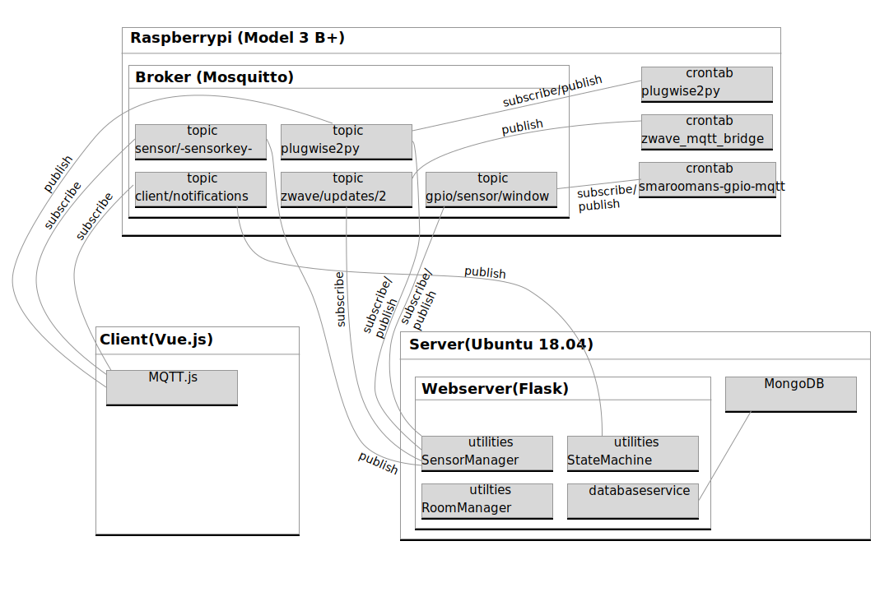

# Smaroomans
In case of the Smart Cities lectures we implemented a "Smart Room Management System".

Organize your Office/Home Office days in you Web-Planner. On Office days receive room Notifications to optimize energy consumption and working conditions


## System Architecture


## Quick start
1. Set up the raspberry pi as described in smaroomans-gpio/readme.md
2. load submodules
```bash
git submodule init
git submodule update
```
3. install and run webserver as described in smaroomans-webserver/readme.md


